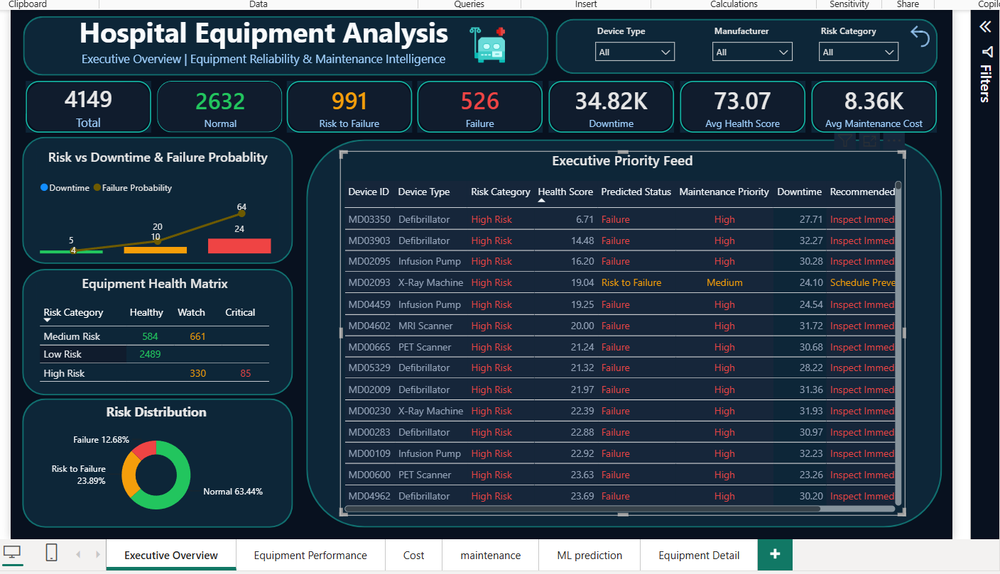
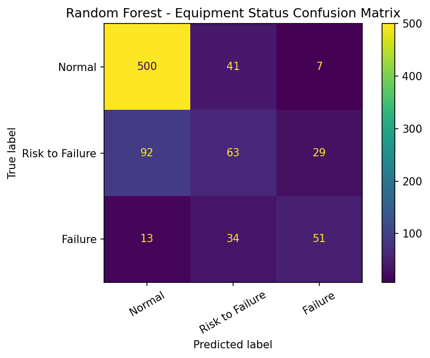
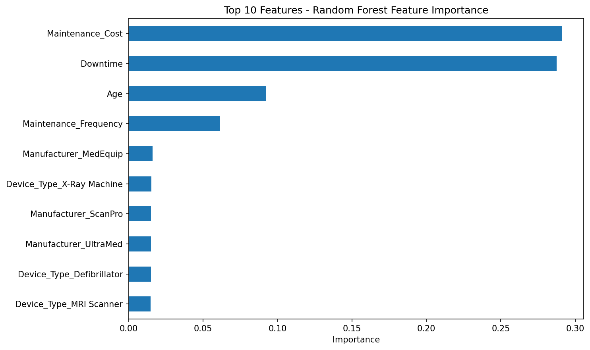
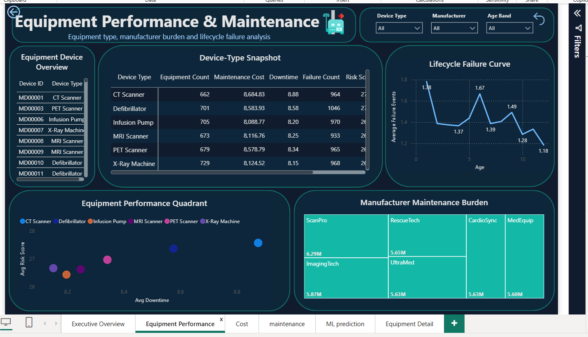
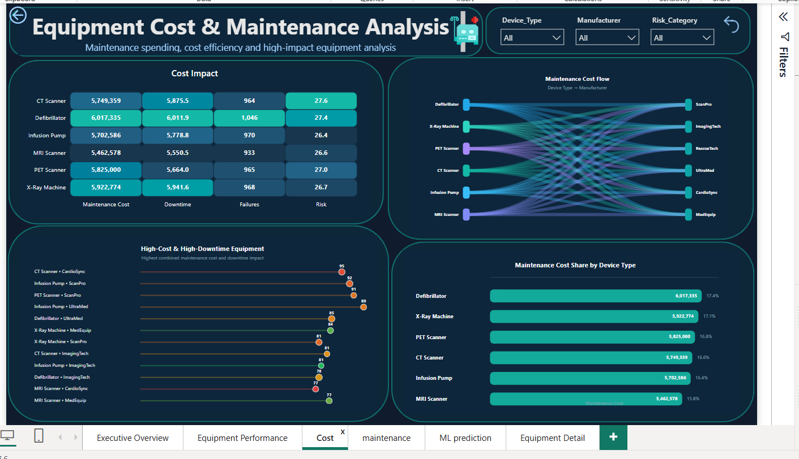
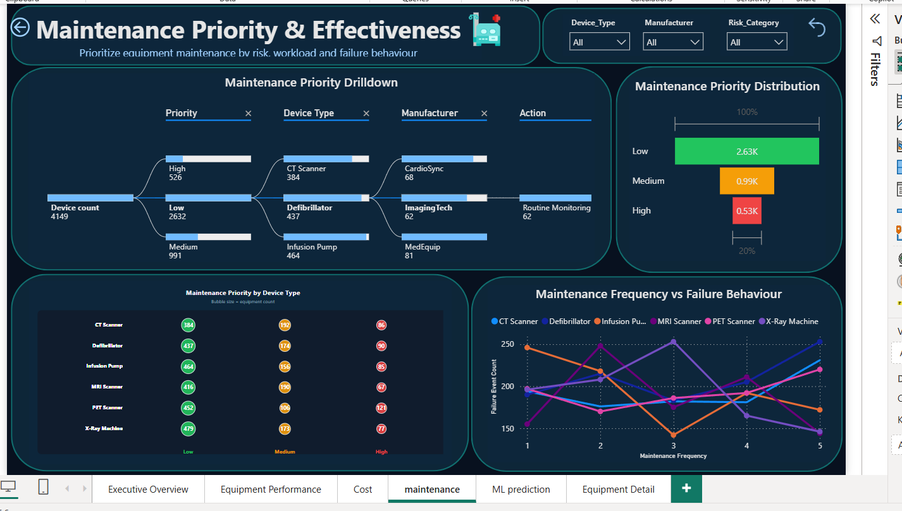
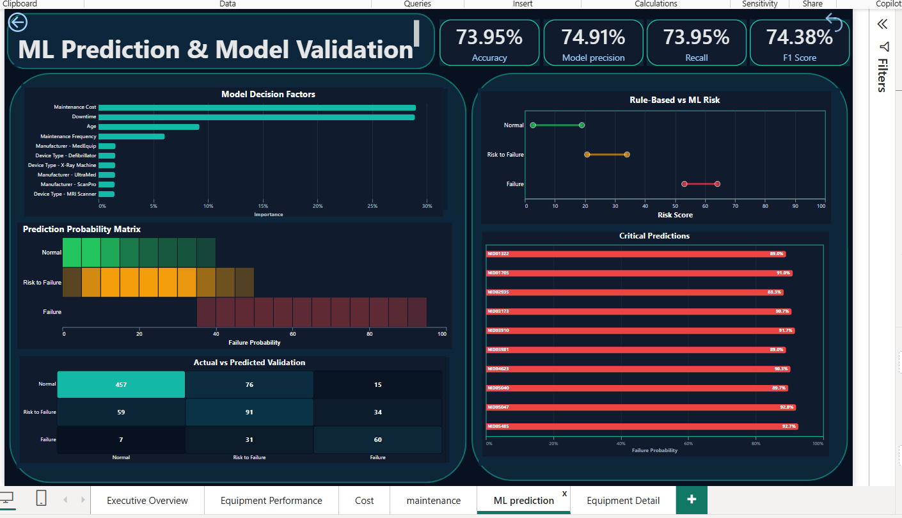
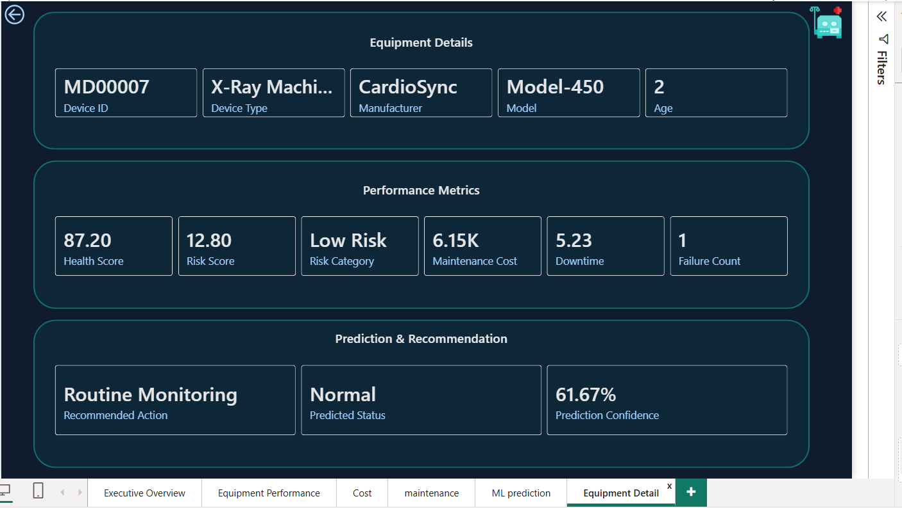

# Hospital Equipment Analysis

**Predictive maintenance and risk analytics for a hospital medical equipment fleet**, built on a SQL → Python (ML) → Power BI pipeline.



---

## 1. Overview

This project turns hospital equipment failure and maintenance data into a decision-support system for identifying equipment health, operational risk, maintenance priorities, and ML-based failure predictions.

| Layer | Tool | Purpose |
|---|---|---|
| Data preparation | Python | Clean data and engineer analytical features |
| Analytics | SQL Server / SSMS | Validate data, perform business analysis, and create production views |
| Predictive modeling | Python / scikit-learn | Train Random Forest failure-status model |
| Decision layer | Power BI | 6-page interactive dashboard |

---

## 2. Dataset

- **Source:** [Medical Device Failure Dataset (Anonymized) — Kaggle](https://www.kaggle.com/datasets/antoinepierreno/medical-device-failure-dataset-anonymized)
- **Raw dataset:** 4,149 rows × 13 columns
- **Final cleaned dataset:** **4,149 rows × 22 columns**
- Raw source data is **not included** in the repository (see note below).
- The repository contains the cleaned dataset (`Data/Medical_Device_Failure_Cleaned.csv`) and ML prediction output (`Data/ML_Predictions.csv`) needed to run the SQL and Power BI layers directly.

**To reproduce from scratch:** download the raw dataset from the source above, place it as `Data/Medical_Device_Failure_dataset.csv`, then run `Python/data_cleaning.py` followed by `Python/random_forest.py` (both scripts use relative paths and expect to be run from inside the `Python/` folder).

---

## 3. Data Cleaning & Feature Engineering

Python is used for data preparation and feature engineering.

Key steps:

- Missing-value and duplicate checks
- Data-type validation
- IQR outlier analysis for `Age`, `Downtime`, and `Maintenance_Cost`
- Negative `Maintenance_Cost` validation and correction
- Risk and health feature creation

### Risk Score

Four normalized risk factors are combined using fixed weights:

```text
Risk Score =
    (Age Risk × 0.20)
  + (Downtime Risk × 0.30)
  + (Failure Risk × 0.30)
  + (Cost Risk × 0.20)
```

### Health Score

```text
Health Score = 100 − Risk Score
```

Higher Health Score indicates healthier equipment.

### Risk Category

| Category | Threshold |
|---|---:|
| High Risk | ≥ 48.03 |
| Medium Risk | ≥ 27.06 |
| Low Risk | < 27.06 |

### Downtime

```text
Total Downtime = SUM(Downtime)
Average Downtime = AVERAGE(Downtime)
```

The Executive Overview reports approximately **34.82K total downtime**.

### Maintenance Cost

```text
Total Maintenance Cost = SUM(Maintenance_Cost)
Average Maintenance Cost = AVERAGE(Maintenance_Cost)
```

---

## 4. SQL Layer

| Script | Purpose |
|---|---|
| `01_Database_Setup.sql` | Creates the Hospital Equipment Analytics database |
| `02_Data_Quality_Analysis.sql` | Data quality and validation checks |
| `03_Business_Analytics.sql` | Equipment, cost, downtime, and failure analysis |
| `04_Advanced_SQL_Analytics.sql` | Ranking, benchmarking, risk, and priority analytics |
| `05_ML_Integration.sql` | Integrates Python ML predictions with equipment analytics |
| `06_PowerBI_Views_FINAL.sql` | Consolidated production views used by Power BI |

### Final Power BI Views

`vw_Executive_KPI` · `vw_Equipment_Risk` · `vw_ML_Predictions` · `vw_Equipment_ML_Analytics` · `vw_DeviceType_Performance` · `vw_Manufacturer_Performance` · `vw_Maintenance_Priority` · `vw_ML_Status_Summary`

---

## 5. Machine Learning

A **Random Forest Classifier** predicts three equipment-status classes:

**Normal · Risk to Failure · Failure**

### Target

```text
0–1 failures  → Normal
2–3 failures  → Risk to Failure
4+ failures   → Failure
```

### Features

`Age`, `Maintenance_Frequency`, `Maintenance_Cost`, `Downtime`, `Device_Type`, `Manufacturer`, `Model`

`Failure_Event_Count`, `Risk_Score`, and `Health_Score` are excluded from model inputs to avoid leakage.

### Training

- Random Forest Classifier
- Class-balanced training
- 80/20 stratified train/test split
- 5-fold stratified cross-validation for full-fleet predictions

### Model Performance

| Metric | Score |
|---|---:|
| Accuracy | **73.95%** |
| Precision | **74.91%** |
| Recall | **73.95%** |
| F1 Score | **74.38%** |



**Top decision factors:** `Maintenance_Cost` and `Downtime`, followed by `Age` and `Maintenance_Frequency`.



### ML Output

Each equipment record receives:

- `Predicted_Status`
- `Failure_Probability`
- `Prediction_Confidence`
- `Recommended_Action`

---

## 6. Power BI Dashboard

The final dashboard contains **6 pages**.

### 01 — Executive Overview

Fleet KPIs, risk vs downtime, equipment health matrix, risk distribution, and executive priority feed.


### 02 — Equipment Performance & Maintenance

Device-type snapshot, performance quadrant, lifecycle failure curve, and manufacturer maintenance burden.



### 03 — Equipment Cost & Maintenance Analysis

Cost impact, maintenance cost flow, high-cost/high-downtime equipment, and cost share by device type.



### 04 — Maintenance Priority & Effectiveness

Priority drilldown, priority distribution, device-type priority, and maintenance frequency vs failure behaviour.



### 05 — ML Prediction & Model Validation

Accuracy, precision, recall, F1, model decision factors, prediction probability matrix, rule-based vs ML risk, and critical predictions.



### 06 — Equipment Detail

Drill-through view showing equipment identity, performance metrics, risk, prediction, confidence, and recommended action.



---

## 7. Key Results

```text
Final Dataset        : 4,149 × 22

Normal               : 2,632
Risk to Failure      : 991
Failure              : 526

Average Health Score : 73.07

Accuracy             : 73.95%
Precision            : 74.91%
Recall               : 73.95%
F1 Score             : 74.38%
```

---

## 8. Architecture

```text
Medical Device Failure Dataset
          ↓
Python — Cleaning & Feature Engineering
          ↓
Final Cleaned Dataset
4,149 × 22
          ↓
SQL Server — Validation & Analytics
          ↓
Random Forest — ML Prediction
          ↓
Final Power BI SQL Views
          ↓
Power BI — 6-Page Dashboard
```

---

## 9. Tech Stack

`SQL Server` · `SSMS` · `Python` · `pandas` · `scikit-learn` · `matplotlib` · `Power BI` · `DAX` · `Deneb`

---

## 10. Repository Structure

```text
Hospital-Equipment-Analysis/
│
├── Data/
│   ├── Medical_Device_Failure_Cleaned.csv
│   └── ML_Predictions.csv
│
├── SQL/
│   ├── 01_Database_Setup.sql
│   ├── 02_Data_Quality_Analysis.sql
│   ├── 03_Business_Analytics.sql
│   ├── 04_Advanced_SQL_Analytics.sql
│   ├── 05_ML_Integration.sql
│   └── 06_PowerBI_Views_FINAL.sql
│
├── Python/
│   ├── data_cleaning.py
│   └── random_forest.py
│
├── Dashboard/
│   └── Hospital_Equipment_Analysis.pbix
│
├── assets/
│   ├── screenshots/
│   │   ├── 01_executive_overview.png
│   │   ├── 02_equipment_performance.png
│   │   ├── 03_cost_analysis.png
│   │   ├── 04_maintenance_priority.png
│   │   ├── 05_ml_prediction.png
│   │   └── 06_equipment_detail.png
│   └── graphs/
│       ├── confusion_matrix.png
│       └── feature_importance.png
│
└── README.md
```

---

## 11. Limitations

- The dataset is anonymized/synthetic-style analytical data, not a live hospital monitoring feed.
- The model achieves approximately 74% overall accuracy and is intended as decision support.
- ML predictions do not replace physical equipment inspection or professional maintenance decisions.
- Rule-based `Risk_Category` and ML-based `Predicted_Status` are separate analytical layers.
